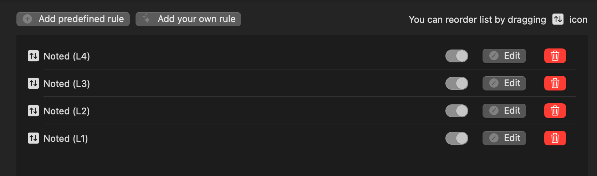

# Neo (Noted) Keyboard Layout

Using noted layout for ergonomic typing in german and english.

## Installation

1. macOS keyboard input source to German
2. Install [Karabiner](https://karabiner-elements.pqrs.org/)
3. Use Layers in Complex Modifications
   
4. Set Virtual Keyboard to ANSI
   

## Problems

- `Shift` + `¸` not working
- `Shift` + `5` not working
